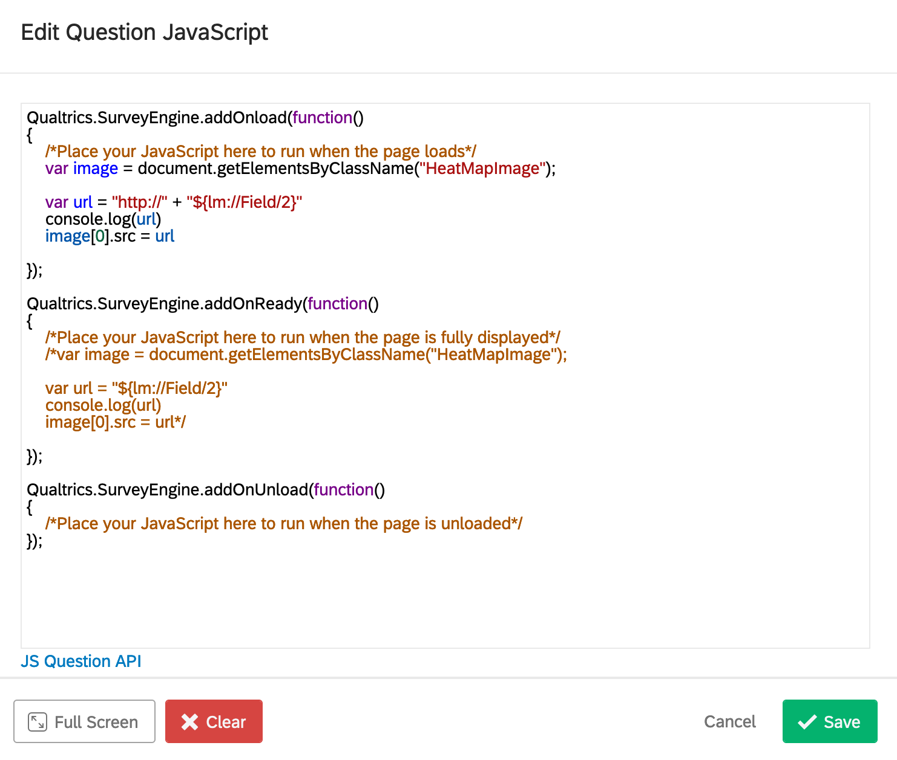

# caption_api
A simple Flask app for serving captions and images to a Qualtrics survey

## Introduction

Designing an annotation interface from scratch is complicated, but survey website Qualtrics provides many question types which can be shoe-horned into use as an annotation interface. It's surprising how much you can do with multiple choice and text fields, but additionally, they provide "Heat Maps", where users can click on graphics, "Ranked Order", where users can reorder lists, and many other options. 

Some of these additional question types might be restricted by your account administrator because they do not meet universal accessibility standards, but for research purposes, getting an exemption is easy, at least at UC Boulder. Just fill out an [exemption request](https://oit.colorado.edu/services/business-services/qualtrics/accessibility#workarounds).

The key challenge for using this interface for annotation is that you don't want to manually write questions for thousands of annotation prompts. The work-around is to automatically populate the survey questions with database entries retrieved from a Flask API.

This repo contains an example Flask app and a walkthrough for how to configure the Qualtrics survey and MTurk HIT.

## Setting up the API

See [server/README](server/README.md)

## Generating Qualtrics survey questions

### Call API

1. Go to the "Survey Flow" tab of your project. 
   
2. Add a new "Web Service" element before the block where your generated questions will appear.
3. Set the url to be the url of your API, and click the "Test" button. The "Embedded Fields" should automatically populate with your API GET values.
    

### Setting up Loop and Merge Block

1. Back in the survey "Builder" tab, set the block where your generated questions will appear to be a "Loop and Merge" block.
    
2. Set the fields of the "Loop and Merge" to loop over the embedded variables from the API Web Service.
    
3. Now this block will iterate over the embedded variables and generate a question for each "Loop and Merge" row. 

### The Questions
There are two ways to integrate the variables into the questions, using HTML and using Javascript. It depends on the type of question which one will be required.

#### Using HTML
For text in the question description, or text choices such as multiple choice questions. You can simply use the variables directly in HTML. 

For example, here is a snippet which has an HTML heading element. Notice that you use the loop and merge variable name, not the web service variable name!

```
Click the object which best fits the following description:

<h2>${lm://Field/1}</h2>
```


#### Using JavaScript 
For other questions, like the Heat Map questions, you will need to use the Question Behavior -> Javascript option to change the question elements such as the images.

Here's an example of changing the image url on a Heat Map question.



```
Qualtrics.SurveyEngine.addOnload(function()
{
	/*Place your JavaScript here to run when the page loads*/
	var image = document.getElementsByClassName("HeatMapImage");
    
	var url = "http://" + "${lm://Field/2}"
	console.log(url)
	image[0].src = url

});

Qualtrics.SurveyEngine.addOnReady(function()
{
	/*Place your JavaScript here to run when the page is fully displayed*/
	/*var image = document.getElementsByClassName("HeatMapImage");
    
	var url = "${lm://Field/2}"
	console.log(url)
	image[0].src = url*/

});

Qualtrics.SurveyEngine.addOnUnload(function()
{
	/*Place your JavaScript here to run when the page is unloaded*/
});
```

## Setting up MTurk
You can recruit your annotators from anywhere, collegues, friends, volunteers, etc. But if you want to use Amazon Mechanical Turk, or MTurk, here's how to set up a survey completion code, so that you can validate whether a turker completed your survey.

### Qualtrics Side
1. Add a random number generator as the first item in the "Survey Flow". Name the embedded data variable something like `MTurkCode`.
    
2. Change your "End of Survey" to have a custom message
    
3. Display the random number as part of the custom message by using the embedded data `${e::/Field/MTurkCode}`
    
4. The random number will be saved as part of the survey results for each survey participant. You can use it as a unique identifier and survey completion code.


### MTurk Side

1. Create a new project using the "Survey Link" template. 
2. Use the Qualtrics survey "Annoymous Link" distribution url as the url in the template.
3. The survey code will be the randomly generated completion code from the previous section
4. You will need to write a script to cross reference the MTurk batch result CSV and the Qualtrics CSV. If the completion codes match, you should approve the worker's HIT.
 